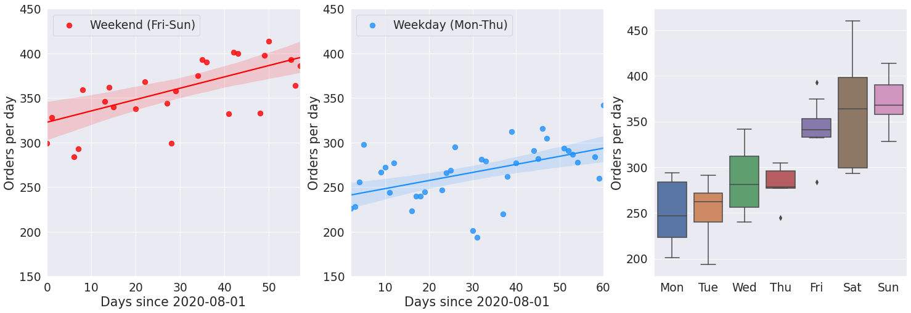

# Analysing the flow of Wolt orders

An analysis of time series data gathered over a two month period in the
autumn of 2020. This was one of the assignments for the Wolt data science summer internship.

## Dependencies
Uses
- pandas
- numpy
- sklearn
- matplotlib
- seaborn
